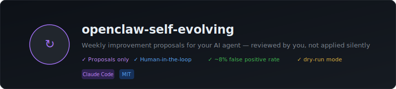
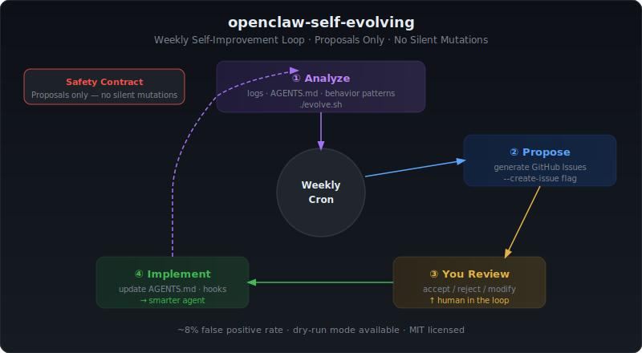

<div align="center">

# 자가진화 에이전트

### *AI 에이전트가 자신의 로그를 검토하고 행동 개선안을 매주 자동으로 제안합니다.*

**같은 실수를 반복하게 두지 마세요. 에이전트 스스로 배우게 하세요.**

[](https://github.com/Ramsbaby/openclaw-self-evolving/stargazers)
[](https://github.com/Ramsbaby/openclaw-self-evolving/actions/workflows/ci.yml)
[](LICENSE)
[](#)
[](#)
[](#)
[](#)

> 에이전트 행동이 개선됐다면 ⭐ 하나가 다른 사람들이 찾는 데 큰 힘이 됩니다.

[⚡ 빠른 시작](#-빠른-시작) · [🔍 감지 패턴](#-감지하는-것-6가지-패턴) · [📋 실제 결과](#-실제-결과) · [🤖 Claude Code](#-claude-code--agentsmd)

</div>

<p align="center"></p>

---

## 빠른 설치

```bash
curl -fsSL https://raw.githubusercontent.com/Ramsbaby/openclaw-self-evolving/main/install.sh | bash
```

그런 다음 로그 경로를 지정하세요:

```bash
# config.yaml 수정 — agents_md와 logs_dir 설정
nano ~/.local/share/openclaw-self-evolving/config.yaml
```

---

## 이게 뭔가요?

**Self-Evolving은 주간 에이전트 개선 파이프라인입니다** — LLM 없음, API 호출 없음, 클라우드 없음.

에이전트의 세션 로그를 읽고, 잘못된 행동 패턴(재시도 루프, 규칙 위반, 사용자 불만)을 찾아내, 1분 안에 승인하거나 거절할 수 있는 정확한 `AGENTS.md` / `CLAUDE.md` 규칙 변경안을 제시합니다.

**에이전트가 스스로를 수정하지 않습니다.** 모든 변경은 사람이 승인합니다. 그게 핵심입니다.

---

## 문제

AI 에이전트는 같은 실수를 반복합니다. 수천 개의 대화 로그를 일일이 검토할 시간은 없죠. 실수는 조용히 쌓여갑니다.

```
1주차: 에이전트가 git을 직접 호출 — 수정해줌
2주차: 같은 실수 반복
3주차: 또 반복
4주차: 여전히 반복 — 3주 낭비
```

**Self-Evolving이 검토를 자동화합니다** — 매주 무엇을 고쳐야 하는지 짧은 목록으로 가져다줍니다.

```
1주차: CLAUDE.md 규칙 위반으로 git을 직접 호출 4회
2주차: 같은 실수 3회 더
3주차: Self-Evolving이 감지 → 더 강력한 규칙 승인 → 다시는 발생하지 않음
```

---

## 작동 방식

```
에이전트 실행                     Self-Evolving 실행 (주간)
──────────────                    ──────────────────────────────
                                  
세션 로그          ─────────►   1. analyze-behavior.sh
~/.openclaw/logs/                   • JSONL 세션 로그 스캔
~/.claude/logs/                     • 재시도 루프, 에러, 규칙 위반,
                                      사용자 불만 감지
AGENTS.md / CLAUDE.md ──────────►   • API 호출 없음 — 순수 bash + python3
  (현재 규칙)
                                  2. generate-proposal.sh
                                     • Before/After diff 제안 생성
                                     • 이전에 거절된 ID 필터링
                                     • Discord 게시 / GitHub Issue 생성

                                  3. 검토
                     ◄─────────     • ✅ 반응 = 적용 + git commit
                                     • ❌ 반응 = 거절 (저장, 재제안 없음)
                                     • 1️⃣–5️⃣ 반응 = 특정 제안만 승인
```

**파이프라인 하나, 스크립트 세 개, 지속 비용 $0.**

<p align="center"></p>

---

## 전후 비교

### Self-Evolving 적용 전

```
에이전트 행동 로그 (4주):
  [1주차] exec: git push origin main      ← CLAUDE.md: git-sync.sh 사용 규칙 위반
  [2주차] exec: git push origin main      ← 같은 위반
  [3주차] exec: git pull                  ← 같은 위반
  [4주차] exec: git commit -m "fix"       ← 여전히 반복

사용자: "왜 또 git을 직접 호출하는 거야?"
에이전트: "앞으로는 git-sync.sh를 사용하겠습니다"
[5주차] exec: git push origin main        ← 또 반복
```

### Self-Evolving 1사이클 후

**자동 생성된 제안:**

```diff
## Git 규칙
- 직접 git 명령어 사용 금지.
+ 직접 git 명령어 사용 금지. (git add / commit / push / pull / fetch 포함)
+ ⚠️ 중요 — 3주간 4회 위반. 모든 git 작업에는 bash ~/openclaw/scripts/git-sync.sh 사용.
```

**✅ 반응 → 규칙 적용 → 다시는 발생하지 않음.**

---

## 실제 출력 예시

```
🧬 Self-Evolving Agent Weekly Report v3.2

분석 기간: 2026-03-17 ~ 2026-03-24
분석 세션: 23개
툴 재시도 이벤트: 47개 ← 새로 감지
개선 제안: 3개

---

### 🔁 제안 #1: exec 툴 연속 재시도 패턴 (8개 세션 영향)

심각도: 🔴 높음  |  유형: 📝 AGENTS.md 추가  |  점수: 92

> 근거:
> 지난 7일: 8개 세션에서 exec가 5회 이상 연속 호출됨
> 최악의 연속 횟수: 23회 연속 (중단 없음)
> 총 재시도 이벤트: 47회
> → 동일한 툴을 5회 이상 연속 호출 = 실패/재시도 루프 신호

현재 (Before):
  exec 연속 재시도에 대한 규칙 없음

제안 (After):
  ## exec 연속 재시도 방지
  같은 exec를 3회 이상 재시도하기 전:
  1. 첫 번째 실패: 오류를 사용자에게 보고
  2. 두 번째 시도: 접근 방식 변경 (다른 플래그/경로)
  3. 세 번째 실패: 중단하고 수동 확인 요청

---

### 승인

이모지로 승인/거절:
| 이모지 | 액션 |
|--------|------|
| ✅ | 전체 승인 → 자동 적용 + git commit |
| 1️⃣–5️⃣ | 해당 번호 제안만 승인 |
| ❌ | 거절 (코멘트 추가 → 다음 분석에 반영) |
| 🔄 | 수정 요청 |
```

---

## 호환 플랫폼

| 플랫폼 | 지원 | 비고 |
|--------|------|------|
| **Claude Code** | ✅ 완전 지원 | CLAUDE.md / AGENTS.md 규칙 |
| **OpenClaw** | ✅ 완전 지원 | 네이티브 로그 포맷 지원 |
| **모든 JSONL 에이전트 로그** | ✅ 부분 지원 | 세션 로거 호환 |

> OpenClaw는 지원 플랫폼 중 하나일 뿐 — 필수 조건이 아닙니다. Claude Code는 즉시 사용 가능합니다.

---

## ⚡ 빠른 시작

### 사전 요구사항

- `python3` (macOS/Linux 기본 내장)
- `bash` 3.2+
- JSONL 형식의 에이전트 로그 (Claude Code: `~/.claude/logs/`, OpenClaw: `~/.openclaw/agents/`)
- 5분

### Option A: 원라인 설치 (권장)

```bash
curl -fsSL https://raw.githubusercontent.com/Ramsbaby/openclaw-self-evolving/main/install.sh | bash
```

`~/.local/share/openclaw-self-evolving/config.yaml`에서 `agents_md`와 `logs_dir`을 설정한 후:

```bash
# 드라이런 먼저 — 변경 없이 감지 내용 확인
bash scripts/generate-proposal.sh --dry-run

# 주간 크론 등록
bash scripts/setup-wizard.sh
```

### Option B: Claude Code (git clone)

```bash
git clone https://github.com/Ramsbaby/openclaw-self-evolving.git
cd openclaw-self-evolving
cp config.yaml.example config.yaml
```

`config.yaml` 편집:
```yaml
agents_md: ~/your-project/CLAUDE.md    # CLAUDE.md 경로
logs_dir: ~/.claude/logs               # Claude Code 로그 경로
```

```bash
# 드라이런 먼저
bash scripts/generate-proposal.sh --dry-run

# 문제가 발견되면 전체 설정 실행
bash scripts/setup-wizard.sh   # 주간 크론 등록
```

### Option C: OpenClaw (clawhub)

```bash
clawhub install openclaw-self-evolving
bash scripts/setup-wizard.sh
```

---

## 🤖 Claude Code / AGENTS.md

Claude Code의 `CLAUDE.md` 또는 `AGENTS.md` 규칙과 직접 연동됩니다.

**설정:**
```yaml
# config.yaml
agents_md: ~/your-project/CLAUDE.md   # 또는 AGENTS.md
logs_dir: ~/.claude/logs               # 로그 경로
```

**동작:**
1. Claude Code 세션 로그 스캔
2. 패턴 감지: 규칙 위반, 반복 실수, 사용자 불만
3. `CLAUDE.md`에 적용할 정확한 diff 제안
4. 승인 → 변경 적용 + git commit

---

## 🔍 감지하는 것 (6가지 패턴)

**1. 툴 재시도 루프** — 같은 툴을 5회 이상 연속 호출. 에이전트 혼란 신호.

**2. 반복 에러** — 세션 전반에 걸쳐 같은 에러 5회 이상. 수정되지 않은 버그.

**3. 사용자 불만** — "이미 말했잖아", "왜 또", "다시", "또" 같은 키워드 — 컨텍스트 필터링 포함.

**4. AGENTS.md / CLAUDE.md 위반** — 실제 `exec` 툴 호출에서 규칙 위반, 규칙 파일과 교차 검증.

**5. 무거운 세션** — 컨텍스트 창 85% 이상 도달한 세션. 서브에이전트로 분리해야 하는 태스크.

**6. 미해결 학습** — `.learnings/`의 높은 우선순위 항목 중 규칙으로 승격되지 않은 것.

**분석 중 LLM 호출 없음. API 비용 없음. 순수 로컬 로그 처리.**

자세한 내용은 [docs/DETECTION-PATTERNS.md](docs/DETECTION-PATTERNS.md) 참고.

---

## 📋 실제 결과

*단일 사용자 프로덕션 인스턴스 (macOS, 4주):*

| 지표 | 결과 |
|------|------|
| 감지된 패턴 | 30개 세션에서 85개 |
| 주당 제안 수 | 평균 4개 |
| 규칙 위반 감지 | 13개 |
| 오탐률 | ~8% (v5.0) |
| API 비용 | **$0** |

*결과는 인스턴스마다 다릅니다 — 실제 측정값입니다.*

---

## 승인 워크플로우

분석 후 설정된 채널(Discord/Telegram)에 리포트가 게시됩니다. 이모지로 승인 또는 거절하세요:

| 이모지 | 액션 |
|--------|------|
| ✅ | 전체 제안 승인 → 자동 적용 + git commit |
| 1️⃣–5️⃣ | 해당 번호 제안만 승인 |
| ❌ | 거절 (이유 코멘트 추가 → 다음 분석에 반영) |
| 🔄 | 수정 요청 |

거절된 제안 ID는 `data/rejected-proposals.json`에 저장 — 다시 제안되지 않습니다.

---

## 옵션

```bash
# 드라이런 (변경 없음)
bash scripts/generate-proposal.sh --dry-run

# 더 많은 히스토리 스캔
ANALYSIS_DAYS=14 bash scripts/generate-proposal.sh

# GitHub Issue 자동 생성
bash scripts/generate-proposal.sh --create-issue

# 주간 다이제스트 (점수 상위 3개 제안, Markdown)
bash scripts/generate-proposal.sh --weekly-digest
```

---

## 설정

```yaml
# config.yaml
analysis_days: 7          # 스캔할 로그 일수
max_sessions: 50          # 최대 세션 파일 수

# 경로 (표준 OpenClaw 레이아웃에서 자동 감지)
agents_dir: ~/.openclaw/agents
logs_dir: ~/.openclaw/logs
agents_md: ~/openclaw/AGENTS.md   # ← CLAUDE.md 경로로 변경

# 알림
notify:
  discord_channel: ""
  telegram_chat_id: ""

# 감지 임계값
thresholds:
  tool_retry: 5
  error_repeat: 5
  heavy_session: 85
```

---

## 대안 비교

| 기능 | Capability Evolver | **Self-Evolving** |
|---|---|---|
| 묵시적 수정 | ⚠️ 있음 (기본 활성화) | ❌ 절대 없음 |
| 사람 승인 | 선택 (기본 비활성화) | 필수. 항상. |
| 실행당 API 호출 | 다수의 LLM 호출 | **없음** |
| 오탐률 | ~22% (자체 보고) | **~8%** (실측값) |
| 거절 메모리 | 없음 | 저장 + 피드백 반영 |

---

## 함께 쓰면 좋은 도구

**[openclaw-self-healing](https://github.com/Ramsbaby/openclaw-self-healing)** — 크래시 복구 + 자동 수리. Self-healing은 크래시 시 실행. Self-Evolving은 주간으로 크래시의 *원인*을 고치고 에러 패턴을 AGENTS.md 규칙으로 승격합니다.

**[openclaw-memorybox](https://github.com/Ramsbaby/openclaw-memorybox)** — 메모리 위생 CLI. MEMORY.md를 린하게 유지해 에이전트가 컨텍스트 오버플로우로 크래시되는 것을 방지합니다.

---

## 파일 구조

```
openclaw-self-evolving/
├── scripts/
│   ├── analyze-behavior.sh      # 로그 분석 엔진 (JSONL 지원)
│   ├── session-logger.sh        # 구조화된 JSONL 이벤트 로거
│   ├── generate-proposal.sh     # 파이프라인 오케스트레이터
│   ├── setup-wizard.sh          # 대화형 설정 + 크론 등록
│   └── lib/config-loader.sh
├── .github/workflows/ci.yml     # ShellCheck + flake8 린트
├── docs/
│   ├── assets/
│   │   ├── hero.svg
│   │   └── loop.svg
│   ├── DETECTION-PATTERNS.md
│   └── QUICKSTART.md
├── test/fixtures/               # 기여자 테스트용 샘플 JSONL
├── data/
│   ├── proposals/
│   └── rejected-proposals.json
└── config.yaml.example
```

---

## OpenClaw 생태계

| 프로젝트 | 역할 |
|---------|------|
| **[openclaw-self-evolving](https://github.com/Ramsbaby/openclaw-self-evolving)** ← 현재 위치 | 주간 로그 검토 → AGENTS.md/CLAUDE.md 개선 제안 |
| **[openclaw-self-healing](https://github.com/Ramsbaby/openclaw-self-healing)** | 4계층 자율 크래시 복구 |
| **[openclaw-memorybox](https://github.com/Ramsbaby/openclaw-memorybox)** | 메모리 위생 CLI — 비대화 크래시 방지 |
| **[jarvis](https://github.com/Ramsbaby/jarvis)** | Claude Max를 사용하는 24/7 AI 운영 시스템 |

---

## 기여하기

PR 환영 — 특히:
- `analyze-behavior.sh`의 새로운 감지 패턴
- 더 나은 오탐 필터링
- 다른 로그 포맷 지원 (현재 OpenClaw + Claude Code)
- `test/fixtures/`의 테스트 픽스처

---

## 라이선스

[MIT](LICENSE) — 원하는 대로 사용하되, "사람 승인 필수" 부분만은 남겨두세요. 그 부분이 핵심입니다.

---

<div align="center">

**Made with 🧠 by [@ramsbaby](https://github.com/ramsbaby)**

*"최고의 에이전트는 자신의 실수에서 배우는 에이전트입니다."*

[](https://star-history.com/#Ramsbaby/openclaw-self-evolving&Date)

[English README →](README.md)

</div>
